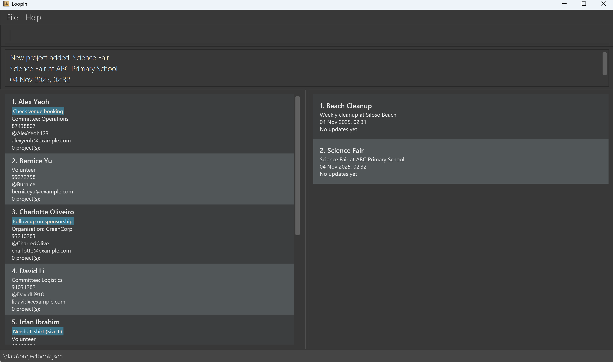

# Loopin - Community Service Project Management

Loopin is a community service project management tool designed to streamline communication and collaboration for project directors, volunteers, and other stakeholders. It greatly simplifies keeping track of project updates, contact details, volunteer involvement, and project progress for your various needs. Currently, it is optimized for users managing multiple community service projects with various parties involved.

## Features (TODO)

For Volunteers:
- View a high-level summary of active projects.
- Browse and filter available projects seeking volunteers.
- Join or exit a project.
- Track overlapping commitments and organize time better.
- Easily search for projects by name and find involved projects quickly.
- Access past updates for projects they are part of.

For Project Managers:
- Keep track of volunteer involvement in each project.
- Manage projects with different teams and stakeholders.
- Add, edit, and remove volunteers, team members, and organizations.
- Organize parties by demographic or role (e.g., Publicity Committee, Operations Committee).
- Send and track project updates to relevant parties.
- Sort updates by deadlines to ensure timely communication.
- Generate templates for messages and easily communicate with stakeholders.
- Generate reports on volunteer information, including a table of volunteers.

General Features:
- Guided tutorial for first-time users (volunteers and project managers).
- Demo entries available to showcase how the app works.
- Fast access to contact details and project updates.
- Organize data with easy import/export options (populate data from files, generate tables).
- Filter and sort various records efficiently.




# Usage (TODO)

After installing and running the app, follow the on-screen instructions for a tutorial of the application.

### First-time users

### Volunteers

### Project Managers


# Contributing
To help develop our project:
```
1. Install MarkBind on your device.
2. run `npm run serve` in `[project root]/docs`. This will open your website in a live preview mode.
3. Edit the `*.md` source files.
```

Steps to contribute:

1. Fork the repository.

1. Clone your forked repository:

1. Create a branch for your changes:

1. Make changes and commit them:

1. Push to your forked repository:

1. Open a pull request on GitHub.


# Credits:
* This project is based on the AddressBook-Level3 project created by the [SE-EDU initiative](https://se-education.org).
* It is named `AddressBook Level 3` (`AB3` for short) because it was initially created as a part of a series of `AddressBook` projects (`Level 1`, `Level 2`, `Level 3` ...).
  Example usages:
  * as a starting point of a course project (as opposed to writing everything from scratch)
  * as a case study
* The project simulates an ongoing software project for a desktop application (called _AddressBook_) used for managing contact details.
  * It is **written in OOP fashion**. It provides a **reasonably well-written** code base **bigger** (around 6 KLoC) than what students usually write in beginner-level SE modules, without being overwhelmingly big.
  * It comes with a **reasonable level of user and developer documentation**.
* For the detailed documentation of this project, see the **[Address Book Product Website](https://se-education.org/addressbook-level3)**.
*  If you would like to contribute code to this project, see [se-education.org](https://se-education.org/#contributing-to-se-edu) for more info.

# Acknowledgments:
MarkBind for documentation generation.
SE-EDU for providing the foundational AddressBook project.

# License
This project is licensed under the MIT License - see the LICENSE

[](https://github.com/AY2526S1-CS2103T-W14-4/tp/actions/workflows/gradle.yml)
[](https://codecov.io/github/AY2526S1-CS2103T-W14-4/tp)
