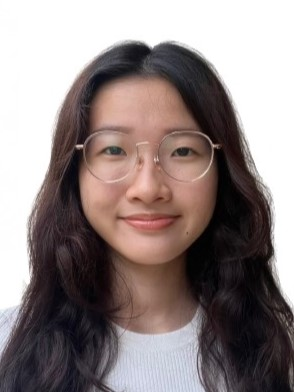

# About Us

We are a team based in the [School of Computing, National University of Singapore](http://www.comp.nus.edu.sg).

You can reach us at the email `seer[at]comp.nus.edu.sg`

## Project team

### Xue Minjie

[[github](http://github.com/Dominique-DP9)]
[[portfolio](team/dom.md)]

* Role: Team Lead

### Ong Yi Xin

[[github](http://github.com/ongyixin)]
[[portfolio](team/ongyixin.md)]

* Role: Developer
* Responsibilities: UI

### Estelle Lim

[[github](http://github.com/estelle-ljgui)]
[[portfolio](team/estelle-ljgui.md)]

* Role: Developer
* Responsibilities: Data

### Pei Jingya

[[github](http://github.com/pei886)]
[[portfolio](team/pei886.md)]

* Role: Developer
* Responsibilities: Dev Ops + Threading

### Hasan Ahmed Nasif

[[github](http://github.com/johndoe)]
[[portfolio](team/johndoe.md)]

* Role: Developer
* Responsibilities: A little bit of everything

