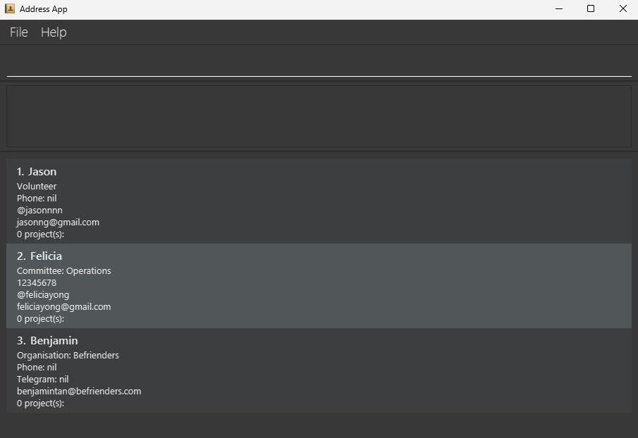
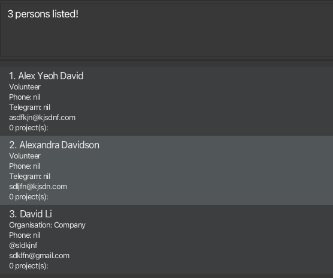

# Loopin User Guide

Loopin is a desktop app that helps project leaders **track team members, organisation partners, volunteers, and project updates** in one place. It is designed for project leads and coordinators, and friendly for first-time users via a CLI (only typing required) interface.

--------------------------------------------------------------------------------------------------------------------

## Command Summary

Action | Format, Examples
---|---
[**Add volunteer**](#addv--addt--addo-adding-a-person-volunteer-teammember-organisationmember) | `addv n/NAME [p/PHONE] e/EMAIL [t/TELEGRAM]`   e.g., `addv n/James Ho p/22224444 e/jamesho@example.com t/jamesho123`
[**Add team member**](#addv--addt--addo-adding-a-person-volunteer-teammember-organisationmember) | `addt n/NAME c/COMMITTEE [p/PHONE] e/EMAIL [t/TELEGRAM]`   e.g. `addt n/Sarah Ng c/Logistics p/12345678 e/sarahng@example.com t/sarahlogistics`
[**Add organisation member**](#addv--addt--addo-adding-a-person-volunteer-teammember-organisationmember) | `addo n/NAME o/ORGANISATION [p/PHONE] e/EMAIL [t/TELEGRAM]`   e.g. `addo n/Timothy Lee o/Example Company p/98371896 e/partner@example.com t/timlee`
[**Clear**](#clear-clearing-all-entries) | `clear`
[**Delete**](#delete-deleting-a-person) | `delete INDEX`  e.g., `delete 3`
[**Edit**](#edit-editing-a-person) | `edit INDEX [n/NAME] [p/PHONE] [e/EMAIL] [t/TELEGRAM]`  e.g.,`edit 2 n/James Lee e/jameslee@example.com t/jameslee123`
[**Remark**](#remark-adding-a-remark) | `remark INDEX u/UPDATE`   e.g. `remark 2 u/add to shared drive`
[**Resolve**](#resolve-resolving-a-remark) | `resolve INDEX REMARK_INDEX `   e.g. `resolve 2 1`
[**Find**](#find-finding-persons) | `find KEYWORD [MORE_KEYWORDS]...`  e.g., `find James Jake`
[**FindRole**](#findrole-finding-persons-by-role) | `findrole ROLE_CHARACTER`   e.g. `find t`
[**List**](#list-listing-all-persons) | `list`
[**Add project**](#project-add-adding-a-project) | `project add project/PROJECT_NAME d/DESCRIPTION`   e.g., `project add project/Beach Cleanup d/Beach cleaning at Siloso Beach`
[**List projects**](#project-list-listing-all-projects) | `project list`
[**View project**](#project-view-viewing-a-project) | `project view project/PROJECT_NAME`   e.g., `project view project/Beach Cleanup`
[**Find project**](#project-find-finding-projects) | `project find KEYWORD [MORE_KEYWORDS]...`  e.g., `find beach`
[**Delete project**](#project-delete-deleting-a-project) | `project delete project/PROJECT_NAME`   e.g., `project delete project/Fundraising Drive`
[**Assign person to project**](#project-assign-assigning-a-person-to-a-project) | `project assign INDEX project/PROJECT_NAME`   e.g., `project assign 3 project/Artshow`   `project assign n/NAME project/PROJECT_NAME`   e.g., `project assign n/Charlotte Oliveiro project/Artshow`
[**Remove person from project**](#project-remove-removing-a-person-from-a-project) | `project remove INDEX project/PROJECT_NAME`   e.g., `project remove 4 project/Wellbeing`  `project remove n/NAME project/PROJECT_NAME`   e.g., `project remove n/David Li project/Wellbeing`
[**Help**](#help-viewing-help) | `help`
[**Exit**](#exit-exiting-the-program) | `exit`

<page-nav-print />

--------------------------------------------------------------------------------------------------------------------

## Getting Started

### 1. Installation
1.  Ensure you have Java `17` or above installed in your Computer. 
    **Mac users:** Ensure you have the precise JDK version prescribed [here](https://se-education.org/guides/tutorials/javaInstallationMac.html). 
    **Windows users:** You may follow this [guide](https://se-education.org/guides/tutorials/javaInstallationWindows.html) to download Java `17`.

2.  Download the latest `.jar` file from our GitHub page.

3.  Copy the file to the folder you want to use as the *home folder* for your ProjectBook.

4.  Open a command terminal, `cd` into the folder you put the jar file in, and use the `java -jar projectBook.jar` command to run the application. 
    A GUI similar to the below (but without any projects) should appear in a few seconds. Note how the app contains some sample data.

    

### 2. Your First Commands (A Quick Tutorial)

1.  Type commands into the command box and press Enter to execute them. For example, typing **`help`** and pressing Enter will open the help window.

2.  The app starts with sample data. Let's clear it by typing **`clear`** and pressing Enter.

3.  Now, let's add your first volunteer. Type:
    `addv n/John Doe p/98765432 e/johnd@example.com`

4.  Next, create a project for John to be a part of. Type:
    `project add project/Beach Cleanup d/Weekly cleanup at Siloso Beach`

5.  You should see John as Item 1 in the person list. Let's assign him to your new project. Type:
    `project assign 1 project/Beach Cleanup`

6.  To see a summary of the project and who's in it, type:
    `project view project/Beach Cleanup`

7.  To see all contacts in your book, type `list`.

8.  To see all projects, type `project list`.

9.  To exit the app, type `exit`.

<box type="warning" seamless>

If you are using a PDF version of this document, be careful when copying and pasting commands that span multiple lines as space characters surrounding line-breaks may be omitted when copied over to the application.

</box>

Refer to the [Features](#features) below for details of each command.

--------------------------------------------------------------------------------------------------------------------

## Features

<box type="info" seamless>

**Notes about the command format:** 

* Words in `UPPER_CASE` are the parameters to be supplied by the user. 
  e.g. in `addv n/NAME`, `NAME` is a parameter which can be used as `addv n/John Doe`.

* Items in square brackets `[]` are optional. 
  e.g `n/NAME [p/PHONE]` can be used as `n/John Doe p/98613698` or as `n/John Doe`.

* `INDEX` refers to the index number shown in the currently displayed list. The index must be a positive integer (1, 2, 3, ...).

* Items with `…` after them can be used multiple times including zero times. 
  e.g. `[u/UPDATE]…` can be used as ` ` (i.e. 0 times), `u/add to group chat`, `u/register in portal` etc.

* Parameters can be in any order. 
  e.g. if the command specifies `n/NAME p/PHONE`, `p/PHONE n/NAME` is also acceptable.

* Extraneous parameters for commands that do not take in parameters (such as `help`, `list`, `exit` and `clear`) will be ignored. 
  e.g. if the command specifies `help 123`, it will be interpreted as `help`.

</box>

<box type="tip" seamless>

 **Pro Tip: Command Chaining**

 The `INDEX` for commands like `edit` or `delete` refers to the *currently displayed list*.

 This means you can "chain" commands. For example:
 1.  Use `find Alex` to show only people whose names contain 'Alex'.
 2.  The list might show two people: `1. Alex Yeoh` and `2. Alexandra Tan`.
 3.  You can then use `delete 1` to delete **Alex Yeoh**, who is the 1st person *in that filtered list*.

</box>

### `help`: Viewing help

Shows a message explaining how to access the help page. The link will bring you to a condensed cheatsheet of commands for your future reference!

**Format:** `help`

---
### `addv` / `addt` / `addo`: Adding a Person (Volunteer, TeamMember, OrganisationMember)

Adds a person of a specific role to the project book. There are 3 roles a person can play: volunteer, committee member, and organisation contact.

<box type="info" seamless>

**What are the 3 types of roles**
* A volunteer is not part of the core team, but is recruited to help with projects. Loopin stores only basic contact information of volunteers.
* A team member is part of the core team and belongs to a committee. Loopin stores the committee and basic contact information of team members.
* An organisation member is someone associated with an external organisation. Loopin stores the organisation and basic contact information of organisation members.

**What is "basic contact information"?**
* A person's name and email are both basic contact information that are required to add a person.
* Additional contact information such as phone number and telegram username can also be stored, but they are not required.

**What is a duplicate person?**
* When adding people into the project book, you might get an error stating that the person is already in the project book.
* A person with the exact same **phone** number, **email** address or **telegram** username will be considered a duplicate person and cannot be added.
* This is because two different people cannot have the same phone number, email address or telegram username.
* People with the same name are not considered duplicate because it is possible for people to have the same name (even the same full name).

</box>

Feature | Command word | Command format | Example
---|---|---|---
Add a volunteer | `addv` | `addv n/NAME e/EMAIL [p/PHONE] [t/TELEGRAM]` | `addv n/James Ho e/jamesho@example.com p/22224444 t/jamesho123`
Add a team member | `addt` | `addt n/NAME e/EMAIL c/COMMITTEE [p/PHONE] [t/TELEGRAM]` | `addt n/Sarah Ng e/sarahng@example.com c/Logistics p/12345678 t/sarah_ng`
Add an organisation member | `addo` | `addo n/NAME o/ORGANISATION e/EMAIL [p/PHONE] [t/TELEGRAM]` | `addo n/Timothy Lee e/partner@example.com o/Example Company p/98371896 t/timlee`

---
### `list`: Listing All Persons

Shows a list of all persons in the project book.

**Format:** `list`

---
### `edit`: Editing a Person

Edits the specified fields of an existing person in the project book.

**Format:** `edit INDEX [n/NAME] [p/PHONE] [e/EMAIL] [t/TELEGRAM]`

**Details:**
* **At least one** of the optional fields must be provided.
* The given value will replace the existing value for that field.
* This command can also be used to update fields that were originally empty.

**Examples:**
* `edit 1 p/91234567 e/johndoe@example.com` edits the phone and email of the 1st person in the currently displayed list.
* `edit 2 n/Betsy Crower` edits the name of the 2nd person in the currently displayed list.

<box type="tip" seamless>

**Tip:** Use `list` or `find` first to get the correct `INDEX` of the person you want to edit!

</box>

---
### `find`: Finding Persons

Finds persons by matching their name to a sequence of keywords.

**Format:** `find KEYWORD [MORE_KEYWORDS]...`

**Details:**

* The search is **case-insensitive** (e.g., `hans` will match `Hans`).
* The search matches **any part of the name** (e.g., `Han` will match `Hans`, `Hannah`, or `Johanson`).
* The order of the keywords does not matter.
* The search results will show persons whose names contain **any keywords**.

**Examples:**
* `find John` returns `John Doe`, `Johnson Tan`.
* `find david alex` returns `Alex Yeoh David`, `Alexandra Davidson`, `David Li`.

---
### `findrole`: Finding Persons by Role

Finds all persons in the project book whose role matches the specified role type.

**Format:**
`findrole ROLE_CHARACTER`

**Details:**
* Accepted role characters include
    * `t` — Team Member
    * `v` — Volunteer
    * `o` — Organisation Member

**Examples:**
* `findrole t` returns all Team Members.
* `findrole v` returns all Volunteers.
* `findrole o` returns all the Organisation Members.

<box type="tip" seamless>

**Tip:** If you want to view all persons after using the `findrole` command, use `list`.

</box>

---
### `remark`: Adding a Remark

Adds a remark to a person. Remarks are used as a "to-do" list or reminder to liaise with a person about a certain update.

**Format:** `remark INDEX u/UPDATE`

**Example:** `remark 2 u/add to shared drive` adds a remark 'add to shared drive' to the 2nd person in the currently displayed list.

---
### `resolve`: Resolving a Remark

Removes a remark from a person after the task is done. After having updated the person, the reminder is no longer needed, thus the corresponding remark can be resolved.

**Format:** `resolve PERSON_INDEX REMARK_INDEX`

**Example:** `resolve 2 1` removes the 1st remark from the 2nd person in the currently displayed list.

---
### `delete`: Deleting a Person

Deletes the specified person from the project book.

**Format:** `delete INDEX`

**Examples:**
* `list` followed by `delete 2` deletes the 2nd person in the project book.
* `find Betsy` followed by `delete 1` deletes the 1st person in the results of the `find` command.

<box type="warning" seamless>

**Warning:** This action is irreversible. Deleted entries cannot be recovered.

</box>

---
### `clear`: Clearing All Entries

Clears all entries (all persons and all projects) from the project book.

**Format:** `clear`

<box type="warning" seamless>

**Warning:** This action is irreversible. Cleared entries cannot be recovered.

</box>

---
### `project list`: Listing All Projects

Shows a list of all projects in the project book.

**Format:** `project list`

---
### `project add`: Adding a Project

Adds a project to the project book.

**Format:** `project add project/PROJECT_NAME d/DESCRIPTION`

**Example:**
`project add project/Beach Cleanup d/Beach cleaning at Siloso Beach` adds a new project named "Beach Cleanup" with the given description. Upon project addition, no persons have been assigned to the project.

<box type="tip" seamless>

**Tip:** Project names are your unique identifiers. Choose clear, unique names like "Annual Gala 2025" instead of just "Gala".

</box>

---
### `project delete`: Deleting a Project

Deletes the specified project from the project book.

**Format:** `project delete project/PROJECT_NAME`

**Example:**
`project delete project/Fundraising Drive`

<box type="info" seamless>

Deleting a project does *not* delete the persons who have been previously assigned to the project. These persons will no longer be associated with the deleted project.

</box>

<box type="warning" seamless>

**Warning:** This action is irreversible. Deleted entries cannot be recovered.
**Warning:** Make sure to use `project delete` and not `delete` if you want to delete a project and not a person.

</box>

---
### `project view`: Viewing a Project

Views the summary of an existing project and its participants.

**Format:** `project view project/PROJECT_NAME`

**Example:**
`project view project/Beach Cleanup`
* Lists the name and description of the project.
* Lists all contacts (volunteers, team members, organisation members) assigned to it.

---
### `project find`: Finding Projects

Finds projects by matching their name to a sequence of keywords.

**Format:** `project find KEYWORD [MORE_KEYWORDS]...`

**Details:**

* The search is **case-insensitive** (e.g., `beach` will match `Beach`).
* The search matches **any part of the project** (e.g., `beach` will match `Beach`, `Beaches`, or `EastCoastBeach`).
* The order of the keywords does not matter.
* The search results will show persons whose names contain **any keywords**.

**Examples:**
* `project find beach` returns `Beach Cleanup`, `Fundraiser Event at East Coast Beach`.
* `project find beach fundraiser` returns `Beach Cleanup`, `Fundraiser Event at East Coast Beach`, `Fundraiser at ABC Primary School`.

---
### `project assign`: Assigning a Person to a Project

Assigns a specified volunteer, team member, or organisation member to a project.

**Formats:**
* `project assign INDEX project/PROJECT_NAME`
* `project assign n/NAME project/PROJECT_NAME`

* Assigns the person at the specified `INDEX`, or with the specified `NAME`, to the specified `PROJECT`.
* The `INDEX` refers to the index number shown in the displayed person list. It **must be a positive integer** (1, 2, 3, …).
* The `NAME` search is **case-insensitive**.
* When you view the project details (`project view`), the assigned person will show up in its details.

**Examples:**
* `project assign 4 project/Startup Showcase`
* `project assign n/Jackson project/Startup Showcase`

---
### `project remove`: Removing a Person from a Project

Removes a specified volunteer, team member, or organisation member from a project.

**Formats:**
* `project remove INDEX project/PROJECT_NAME`
* `project remove n/NAME project/PROJECT_NAME`

* Removes the person at the specified `INDEX`, or with the specified `NAME`, from the specified `PROJECT`.
* The `INDEX` refers to the index number shown in the displayed person list. It **must be a positive integer** (1, 2, 3, …).
* The `NAME` search is **case-insensitive**.
* This only *un-assigns* them; it does not delete the person from the project book.

**Examples:**
* `project remove 4 project/Science Fair`
* `project remove n/Marianne project/Science Fair`

---
### `exit`: Exiting the Program

Exits the program.

Format: `exit`

---
### Saving the data

Loopin's data is saved in the hard disk automatically after any command that modifies data. There is no need to save manually!

---
### Editing the data file

Loopin data are saved automatically as a JSON file `[JAR file location]/data/projectbook.json`. Advanced users are welcome to update data directly by editing that data file.

<box type="warning" seamless>

**Caution:**
If your changes to the data file makes its format invalid, ProjectBook will discard all data and start with an empty data file at the next run. Hence, it is recommended to take a backup of the file before editing it.

</box>

--------------------------------------------------------------------------------------------------------------------

## FAQ

**Q**: **How do I transfer my data to another Computer?**  
**Step 1:** Install the app on the other computer  
**Step 2:** Make a new folder in the same folder as the app, and name it data 
**Step 3:** Copy the original projectbook.json located in the data folder over to the new data folder  
**Step 4:** You are ready to use the project book like before!

--------------------------------------------------------------------------------------------------------------------

## Known issues

1.  **When using multiple screens**, if you move the application to a secondary screen, and later switch to using only the primary screen, the GUI will open off-screen. The remedy is to delete the `preferences.json` file created by the application before running the application again.
2.  **If you minimize the Help Window** and then run the `help` command (or use the `Help` menu, or the keyboard shortcut `F1`) again, the original Help Window will remain minimized, and no new Help Window will appear. The remedy is to manually restore the minimized Help Window.
3.  **When entering extremely long inputs** such as names, phone numbers, emails and remarks, the UI truncates them with a `...`. We plan to fix this in future enhancements by wrapping the text onto the next line. For now, to avoid this, please avoid typing in overly long inputs.

--------------------------------------------------------------------------------------------------------------------
## Coming in Future Versions

1. `undo` feature  
   Are you worried that you might accidentally delete something you shouldn't have?  
   With the upcoming `undo` feature, you can easily undo any unwanted changes!

2. `archive` and `load` feature  
   Are you starting on a fresh new set of projects, but don't want to delete your old ones?  
   Using the upcoming `archive` feature, you can simply archive your old project book and start on a new one! Load the archived data whenever you want using the `load` command!

3. `project edit` feature  
   Want to update a project name or description?  
   Edit a project with the upcoming `project edit` feature!

4. Shortened project commands  
   Are you tired of typing out `project add`, `project delete` and all these other long project command words?  
   Use the upcoming shortened project commands! `project add` can be shortened to `addp`, `project delete` can be shortened to `deletep` and so on!  
   Don't worry if you've gotten used to the old format — they'll still be accepted.

--------------------------------------------------------------------------------------------------------------------
